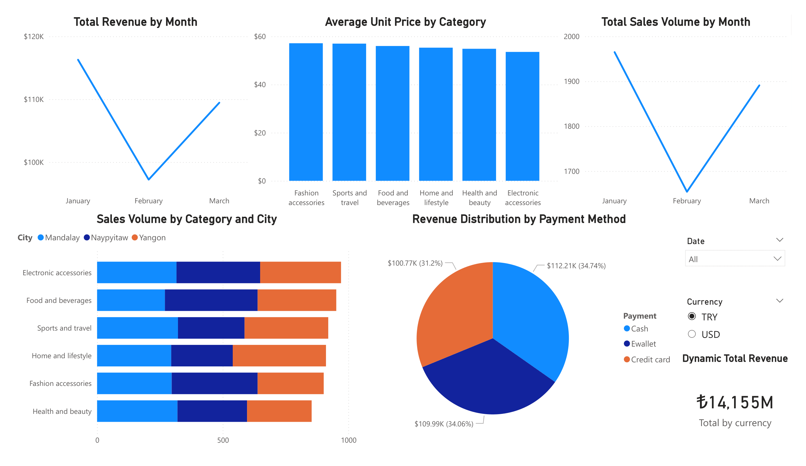

# 💱 Dynamic Sales & Currency Dashboard

## 📌 Overview
This project transforms static supermarket sales data into a dynamic financial dashboard. By integrating a live web API, the dashboard allows users to instantly recalculate total revenue and sales volume across different currencies, providing a real-time view of financial performance.

> **View the Dashboard:**
> 

## 🛠️ Technical Highlights
* **Live API Integration:** Connected directly to the National Bank of Ukraine API via Power Query to pull live USD exchange rates.
* **Dynamic DAX Measures:** Engineered custom logic (`IF`, `MAX`, `FORMAT`) to dynamically switch the entire dashboard's revenue calculations between native and foreign currencies based on user slicer selection.
* **Volume vs. Revenue Analysis:** Built comparative visualizations to highlight the disparity between physical sales volume (`Quantity`) and actual financial intake (`Gross Income`).

## ⚙️ How to Run
1. Download the `supermarket_sales.pbix` file.
2. Open with Power BI Desktop.
3. Click **Refresh** on the Home ribbon to pull the latest exchange rate from the API.
