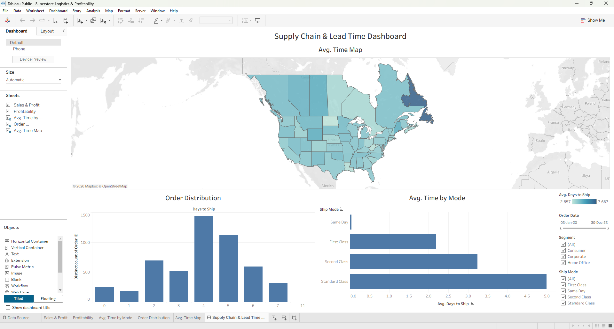

# 🗺️ Supply Chain & Lead Time Optimization

## 📌 Overview
This project focuses on identifying logistical bottlenecks and evaluating the profitability of regional shipping routes. The analytical principles demonstrated here—minimizing lead times, balancing shipping costs, and analyzing geographical distribution constraints—are foundational for solving complex logistical challenges, such as the optimization of spare parts distribution networks for commercial aircraft.

> **Live Dashboard:** [Click here to view the interactive dashboard on Tableau Public](https://public.tableau.com/views/Superstore_Logistics_and_Profitability/SupplyChainLeadTimeDashboard?:language=en-US&:sid=&:redirect=auth&:display_count=n&:origin=viz_share_link)

> *(Replace the line below with your actual screenshot!)*
> 

## 🛠️ Technical Highlights
* **Geospatial Mapping:** Engineered a custom zero-centered heat map across North America to instantly flag unprofitable product sub-categories and regions with high average delivery times.
* **Calculated Logistics Fields:** Utilized date functions (`DATEDIFF`) to extract exact lead times (days to ship) per individual order, rather than relying on aggregated averages.
* **Advanced Charting:** Synchronized dual-axis charts to compare physical sales volume against profit margins on a single unified scale.
* **Global Interactivity:** Implemented optimized, cross-dashboard global filters (Date, Segment, Ship Mode) utilizing 'Apply' buttons to improve query performance on large datasets.
