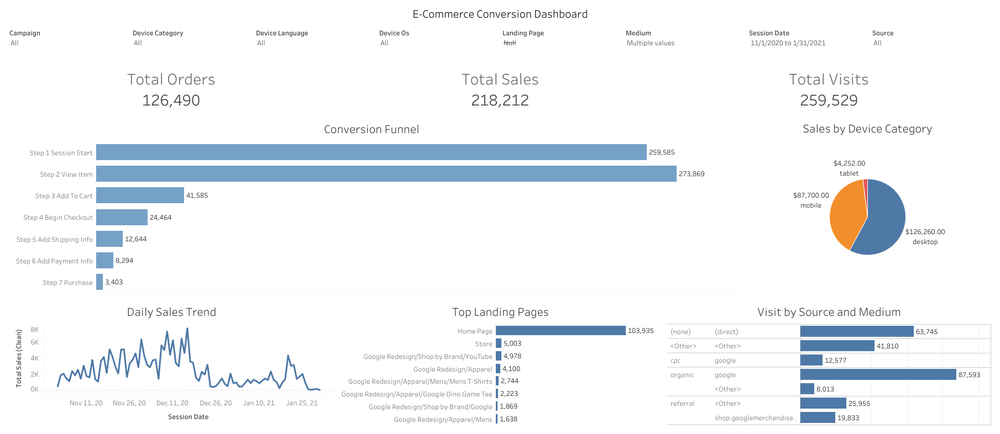

# 04 — GA4 E-commerce Conversion Funnel

> An end-to-end conversion analytics project following the full customer journey on a high-traffic e-commerce store — from first click to purchase — to pinpoint exactly where buyers drop off. Built on Google BigQuery (SQL) and Tableau Public.

---

## 📊 Live Dashboard

🔗 **[View Interactive Dashboard on Tableau Public →](https://public.tableau.com/views/E-commerceConversionDashboard_17831008731970/E-commerceConversionDashboard?:language=en-US&:sid=&:redirect=auth&:display_count=n&:origin=viz_share_link)**

---

## 🎯 Objective

Every online store spends heavily to bring visitors in — but most never buy. A single conversion-rate number hides *where* the losses happen. This project reconstructs the entire 7-step purchase funnel from raw GA4 event data to make the leaks impossible to miss, sliced by device, traffic source, and campaign.

**Dataset:** Google Analytics 4 obfuscated sample e-commerce data (Google Merchandise Store)
**Period:** November 2020 – January 2021
**Scale:** ~259,500 visits · $218K revenue tracked

---

## 👤 Built for a Real Stakeholder

Rather than building a generic dashboard, I designed for a specific persona: **Kerem, a time-poor E-Commerce Manager** who needs a 5-second answer to "how are we converting right now?" — not a twenty-tab spreadsheet.

This constraint shaped every decision: each chart had to earn its place, or it didn't belong on the dashboard.

---

## 🔧 What I Built

**1. Session-Level Funnel Reconstruction (SQL)**
Aggregated raw GA4 events into session-level records using a CTE, extracting the `ga_session_id` from the nested `event_params` array via `UNNEST`. Each session was keyed uniquely with `CONCAT(user_pseudo_id, session_id)` to prevent double-counting.

**2. 7-Step Conversion Funnel**
Counted each funnel event per session using `COUNTIF`, then aggregated across dimensions (date, landing page, source, medium, campaign, device) to build the full path from session start to purchase.

**3. Dynamic Dashboard in Tableau**
KPI cards for visits, orders, and revenue, plus filters for device, source, medium, and campaign — all updating in real time.

---

## 📉 Key Findings

The funnel exposed exactly where the store loses people:

| Step | Event | Count |
|---|---|---|
| 1 | Session Start | 259,585 |
| 2 | View Item | 273,869 |
| 3 | Add to Cart | 41,585 |
| 4 | Begin Checkout | 24,464 |
| 5 | Add Shipping Info | 12,644 |
| 6 | Add Payment Info | 8,294 |
| 7 | Purchase | 3,403 |

**Two critical leaks identified:**

- 🚨 **The browse-to-cart collapse:** ~85% of the 274K product viewers never add anything to cart — the single biggest drop in the funnel.
- 🚨 **The final-hurdle loss:** Over half of users who reach the payment step still don't complete their purchase — direct revenue left on the table.

---

## 🛠️ Technical Challenge — A Correct Chart Nobody Could Read

My first version of the Top Landing Pages chart was technically correct but visually unusable — full of long raw URLs that ran off the screen and wrecked the layout.

I treated it as a UX problem, not a data problem:

- **`REPLACE()` cleanup** — stripped raw URLs down to human-readable page names (e.g. `.../Apparel/Mens/Mens+T-Shirts` → *Mens T-Shirts*)
- **Top 10 filter** — showed only what matters instead of a wall of low-signal rows
- **Container layout** — rebuilt with Tableau Containers for true visual hierarchy and consistent padding

Same data, completely different experience.

---

## 💡 Key Takeaway

Good analytics isn't just writing SQL — anyone can pull the numbers. The value is delivering insight that's **clean, actionable, and visually breathable**, so a non-technical stakeholder can absorb it in seconds and act. Writing the query was maybe a third of the work; making it clear, trustworthy, and genuinely useful was the rest.

---

## 📂 Files

| File | Description |
|---|---|
| [`ga4_ecommerce_funnel.sql`](./ga4_ecommerce_funnel.sql) | BigQuery SQL — session-level funnel reconstruction |
| [`dashboard_screenshot.png`](./dashboard_screenshot.png) | Static preview of the Tableau dashboard |

---

## 🔑 Key SQL Techniques

`UNNEST` for nested GA4 event parameters · `COUNTIF` for per-session event counting · `CONCAT` composite session keys · CTE-based session aggregation · Multi-dimensional `GROUP BY` for funnel slicing
