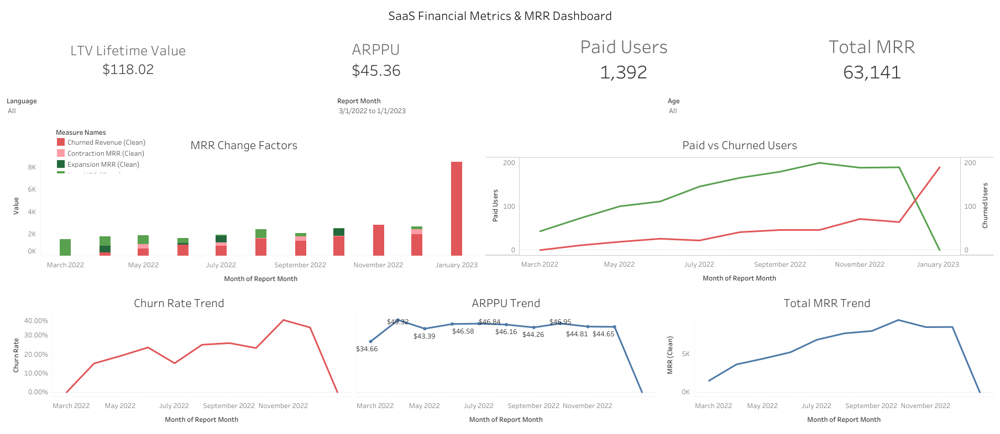

# 05 — SaaS Financial Metrics & MRR Dashboard

> Beyond "total revenue" — a live financial check-up of recurring-revenue dynamics. This dashboard decomposes Monthly Recurring Revenue into its four moving parts (New, Expansion, Contraction, Churn) to reveal whether revenue is healthy and repeatable, not just how much came in. Built on PostgreSQL and Tableau Public.

---

## 📊 Live Dashboard

🔗 **[View Interactive Dashboard on Tableau Public →](https://public.tableau.com/views/SaaSFinancialMetricsMRRDashboard/SaaSFinancialMetricsMRRDashboard?:language=en-US&:sid=&:redirect=auth&:display_count=n&:origin=viz_share_link)**

---

## 🎯 Objective

Most reporting stops at total revenue — which hides everything that matters. A subscription business needs to know *why* revenue moved: Did new customers arrive? Did existing ones upgrade, downgrade, or leave?

This project transforms a flat payments table into a live view of recurring-revenue health, tracking MRR and its four components across 11 months of data.

**Dataset:** SaaS games payments (PostgreSQL)
**Period:** March 2022 – January 2023
**Scale:** $63.1K total MRR tracked · 1,392 paid users · $118 average LTV

---

## 👤 Built for a Real Stakeholder

Designed for **Ayşe, a Finance & Product Director** who owns *revenue quality* — not the vanity top-line total. She needs to watch Lifetime Value and churn move month over month, and slice by user age and language to find exactly where churn is hiding.

Designing for Ayşe meant every metric had to be dynamic and filterable — not a fixed report.

---

## 🔧 What I Built

**1. Four-Stage CTE Pipeline (PostgreSQL)**
The source database only stored monthly payments — you could see revenue's *level* but not its *movement*. I built the intelligence in SQL through a four-stage CTE pipeline:

- `monthly_revenue` — aggregates each user's MRR per month
- `user_status` — uses `LAG()` window functions to look back at each user's previous month
- `revenue_metrics` — classifies every user-month as New, Expansion, or Contraction
- `churn_data` — identifies churned users via a `NOT EXISTS` subquery checking for the absence of a following month's payment

**2. MRR Bridge Classification**
Every single user-month is bucketed into one of four categories by comparing current vs. previous MRR — the core logic that turns a static payments log into a movement story.

**3. Dynamic Tableau Dashboard**
KPI cards (LTV, ARPPU, Paid Users, Total MRR), an MRR change-factors bridge chart, dual-axis paid-vs-churned user trends, and churn rate / ARPPU / MRR trend lines — all filterable by language and age.

---

## 📉 Key Findings

The MRR bridge chart tells the story that total revenue hides:

- **The business is growing** — new and expansion MRR (green) stays positive throughout
- **But the leak is accelerating** — from around August 2022, contraction and churn (coral) grow heavier month over month
- **ARPPU held steady** around $44–47 across most of the period before the tail
- **LTV settled at $118.02** per paying user

This is exactly the early-warning dynamic a Finance Director needs to catch before it hits the top line.

---

## 🛠️ Technical Challenge — The Edge Case That Blanked the Whole Board

My pipeline worked — until it didn't. The dashboard suddenly went completely blank.

**The culprit:** January 2023 was the tail end of the window — 189 users churned, but there were **zero active payments** that month. Because I combined revenue and churn with a `FULL OUTER JOIN`, that month produced rows where the revenue side was `NULL`. In Tableau, a single `NULL` flowing into an LTV or churn-rate table calculation doesn't just blank that cell — it takes down the *entire* calculation, and the board goes empty.

**The two-part fix — really about mindset:**

- **`ZN()` null-guard** — wraps every metric so a missing value becomes `0` before it can propagate and poison downstream calculations
- **LTV as a global aggregate** — instead of fragile month-by-month lookups that hit the join gap, LTV is computed from overall totals. Same insight, far more robust.

The dashboard now renders on every month, including that churn-only tail. I designed for the edge case, not just the happy path.

---

## 💡 Key Takeaways

- **Right axis, right metric** — user counts and revenue figures are different data types and must never share one scale. The paid-vs-churned chart uses a synchronised dual axis so the two can be compared honestly.
- **Design for the edge case** — a dashboard a director can trust *every single morning* is worth far more than a clever one that breaks on the last day of the month.
- **Model for durability** — good analytics isn't just a query that works on clean data; it's a data model that stays correct when messy edge cases arrive. Because they always do.

---

## 📂 Files

| File | Description |
|---|---|
| [`saas_mrr_retention.sql`](./saas_mrr_retention.sql) | PostgreSQL — 4-stage CTE pipeline with MRR classification |
| [`dashboard_screenshot.png`](./dashboard_screenshot.png) | Static preview of the Tableau dashboard |

---

## 🔑 Key SQL Techniques

`LAG()` window functions for month-over-month comparison · 4-stage CTE pipeline architecture · `FULL OUTER JOIN` for revenue-churn reconciliation · `NOT EXISTS` correlated subquery for churn detection · `COALESCE` for join-gap handling · `DATE_TRUNC` for monthly aggregation · MRR bridge decomposition (New / Expansion / Contraction / Churn)
