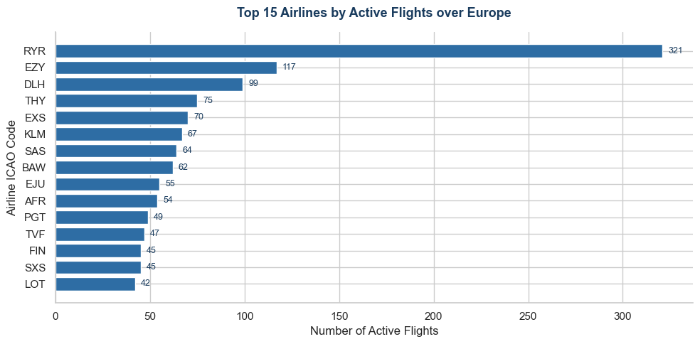
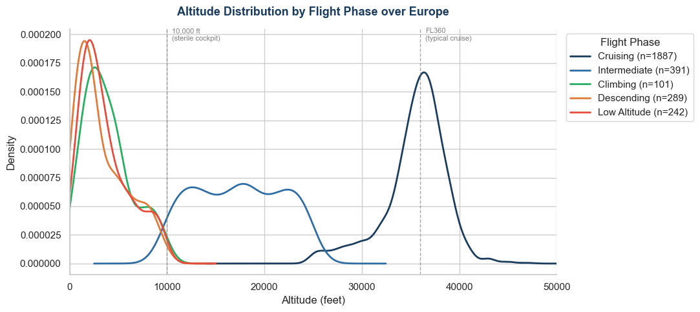
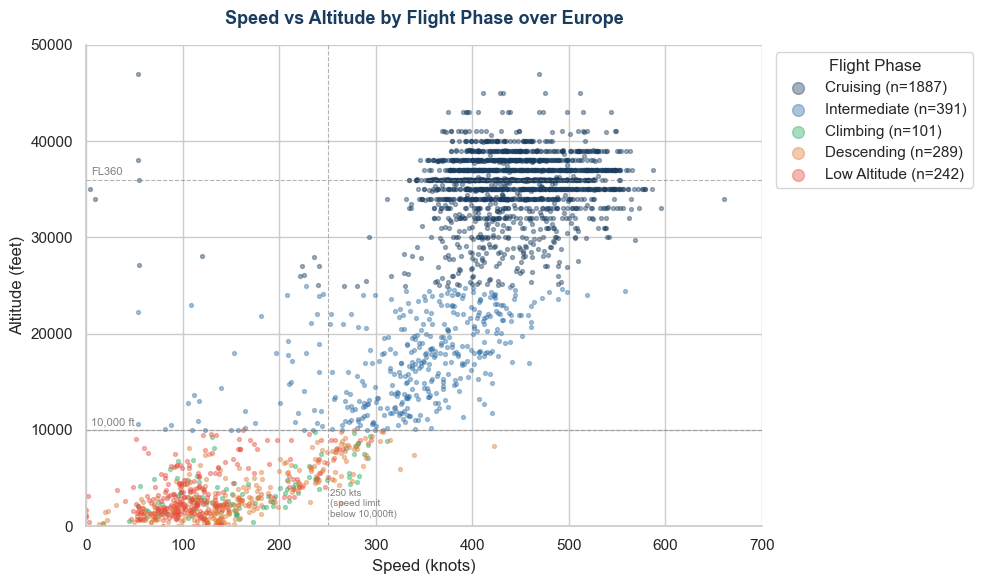

# ✈️ European Airspace Fleet Analysis
> **Turning live ADS-B signals into aviation insight.** This project fetches 
> real-time flight data from the OpenSky Network API and analyses aircraft 
> behaviour across European airspace — combining data engineering with 
> aeronautical domain knowledge to extract findings that go beyond surface-level 
> statistics.

---

## 🎯 Key Questions Answered

| Business Question | Analytical Approach |
| :--- | :--- |
| Which airlines dominate European skies? | Flight count by ICAO airline code |
| How do aircraft behave across flight phases? | Altitude & speed segmentation |
| Does real data respect aviation regulations? | 250 kt speed limit validation below 10,000 ft |
| Where do different countries concentrate their fleets? | Groupby origin country + avg cruise altitude |

---

## 📊 Key Findings

| Metric | Value |
| :--- | :--- |
| Total aircraft analysed | 2,910 |
| Countries represented | 76 |
| Unique airlines detected | 513 |
| Average cruise altitude | 35,507 ft |
| Average cruise speed | 443 knots |
| Top airline by active flights | Ryanair (RYR) — 321 flights |

**Flight phase breakdown at time of snapshot:**
- 🟦 **64.8% Cruising** — majority of aircraft at or above FL300
- 🔵 **13.4% Intermediate** — shorter routes that never reach full cruise altitude
- 🟠 **9.9% Descending** — on approach to destination
- 🔴 **8.3% Low Altitude** — airport environment, below 10,000 ft
- 🟢 **3.5% Climbing** — departing or recovering from a hold

---

## 🚀 Featured Analysis: Live ADS-B Snapshot over Europe

**Data Source:** OpenSky Network REST API  
**Snapshot:** Live fetch — results update every run

### Chart 1 — Top 15 Airlines by Active Flights

Ryanair dominates with **321 active flights** — nearly 3x the next largest 
operator. The top 15 is dominated by low-cost carriers, reflecting the LCC 
model's reliance on high aircraft utilisation and frequent short-haul rotations.

### Chart 2 — Altitude Distribution by Flight Phase

The sharp density peak at **FL360** reflects RVSM (Reduced Vertical Separation 
Minima) — aircraft are assigned specific flight levels, creating characteristic 
banding in the data. The 10,000 ft boundary is clearly visible as the point 
where climbing and descending curves drop to near zero, consistent with sterile 
cockpit procedures.

### Chart 3 — Speed vs Altitude by Flight Phase

The **250 knot speed limit below 10,000 ft** (ICAO standard) is largely 
respected in the data. The dense cruising band at 420–520 knots between 
FL340–FL380 represents the optimal cruise envelope for modern commercial 
narrowbody and widebody aircraft.

---

## 🧠 Core Competencies Demonstrated

- **API Data Fetching:** Authenticated REST API calls with environment variable credential management
- **Data Cleaning:** Handling nulls, unit conversion (m/s → knots, metres → feet), filtering ground traffic
- **Domain-Driven Analysis:** Flight phase classification using altitude + vertical rate — logic an aeronautical engineer thinks in naturally
- **Regulatory Validation:** Cross-checking data against real aviation rules (RVSM, 250 kt limit, sterile cockpit)
- **Data Visualisation:** KDE plots, scatter plots, and bar charts communicating findings to a non-technical audience

---

## 🛠️ Tools & Libraries

| Tool | Purpose |
| :--- | :--- |
| Python 3.13 | Core language |
| Pandas | Data manipulation & groupby analysis |
| Matplotlib / Seaborn | Visualisation |
| Requests | OpenSky Network API calls |
| SciPy | KDE distribution plotting |

---

## 🚀 How to Run

```bash
# 1. Install dependencies
pip install pandas requests matplotlib seaborn scipy

# 2. Set your OpenSky credentials (never hardcode these)
$env:OPENSKY_USER="your_username"
$env:OPENSKY_PASS="your_password"

# 3. Open the notebook
code 07_aviation_fleet_analysis.ipynb

# 4. Run all cells top to bottom
```

> ⚠️ Each run fetches a **fresh live snapshot** — results will differ 
> slightly from the charts above which were captured at a specific point in time.

---

## 👤 Author
**Furkan Batur Tavli** — Aeronautical Engineer & Aviation Data Analyst

[LinkedIn](https://www.linkedin.com/in/fbaturtavli/) · 
[GitHub](https://github.com/fbaturt) · 
[Portfolio](https://github.com/fbaturt/Data-Analytics-Portfolio)
